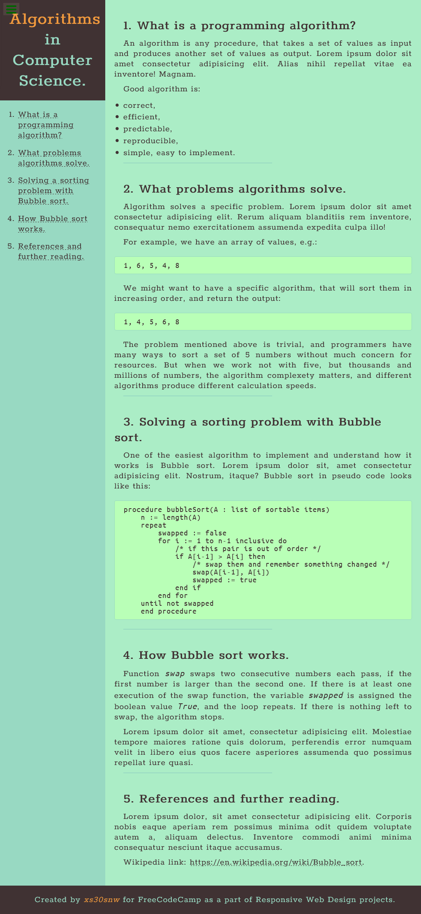

# FreeCodeCamp - Technical Documentation Page

My solution for FreeCodeCamp challenge, where you create a technical documentation page as a part of [the responsive web design series](https://www.freecodecamp.org/learn/responsive-web-design/). In this project I mainly use html and css, in order to hone project's accessibility and source readability.

The site was built with Webpack bundler. Html contains FreeCodeCamp's CDN for tests.

- Live Site URL: [GitHub Pages](https://xs30snw.github.io/FCC_tech-documentation/)

## Screenshot

## Ideas for improvement

- [ ] HTML-Webpack-plugin removes whitespaces inside *code* tag when minifies *index.html* for production. As of now *minify* is set to *false* in *webpack.config.js*, but there should be a proper way to both show formatted code and minify html without losing whitespaces;
- [ ] Better design.